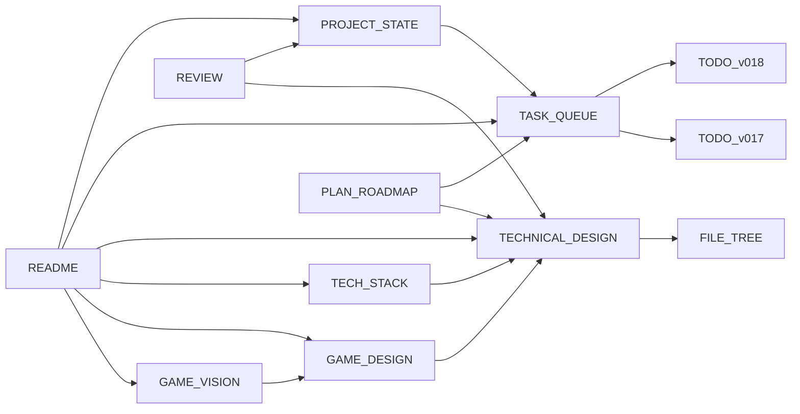

# Loot Realms — Карта содержимого (MOC)

**Главный навигационный узел Obsidian-хранилища проекта.**

---

## 🎯 Видение и концепция

| Заметка | Описание |
|---------|----------|
| [[инструкция/ORIENTATION\|ORIENTATION]] | Быстрая ориентация по проекту (стек, структура, ключевые паттерны) |
| [[GAME_VISION]] | Общее видение игры, философия дизайна, целевая аудитория |
| [[GAME_DESIGN]] | Игровые механики, формулы баланса, системы |

## 🛠️ Технологии и архитектура

| Заметка | Описание |
|---------|----------|
| [[TECH_STACK]] | Выбор технологий (Phaser 3, Vite, Firebase, PeerJS) |
| [[TECHNICAL_DESIGN]] | Архитектура проекта, системы, сцены, потоки данных |
| [[docs/web/module-bundling\|Module Bundling]] | Документация по сборке модулей |

## 📊 Состояние и задачи

| Заметка | Описание |
|---------|----------|
| [[PROJECT_STATE]] | Текущее состояние проекта (v0.16.0+) |
| [[TASK_QUEUE]] | Очередь задач с приоритетами |
| [[TODO_v017]] | План разработки v0.17 (выполнено) |
| [[TODO_v018]] | План разработки v0.18 (следующий) |
| [[PLAN_10x]] | План достижения 10/10 по качеству |

## 📐 Планы разработки

| Заметка | Описание |
|---------|----------|
| [[PLAN_ROADMAP]] | Дорожная карта (v0.12.0 → v0.15.0) |
| [[PLAN_BOSS]] | План: Лес + Босс Трент |
| [[PLAN_SNOWY_VILLAGE]] | План: Snowy Village (v0.11.0) |
| [[PLAN_PROGRESSION]] | План: Прогрессия и Сложность |
| [[BUGFIX_CAVE_STAIRS]] | Багфикс: Cave Stairs Ghost + Account Equip Save |

## 🧪 Код-ревью и метрики

| Заметка | Описание |
|---------|----------|
| [[REVIEW]] | Полный код-ревью (архитектура, качество, баланс) |
| [[BENCHMARKS]] | Бенчмарки производительности |
| [[AGENTS]] | Руководство по агентам AI для разработки |

## 📁 Структура

| Заметка | Описание |
|---------|----------|
| [[FILE_TREE]] | Полная структура файлов проекта |
| [[инструкция/инструкция\|Правила разработки]] | Основные правила и инструкции |

---

## 🏷️ Теги

- `#vision` — Видение и концепция игры
- `#design` — Дизайн и архитектура
- `#tech` — Технологический стек
- `#state` — Состояние проекта
- `#tasks` — Задачи и планы
- `#plan` — Планы разработки
- `#review` — Код-ревью и аудит
- `#agents` — AI-агенты
- `#docs` — Документация

---

## 🗺️ Граф связей

*Последнее обновление: v0.18.0 | Всего заметок: 18*
