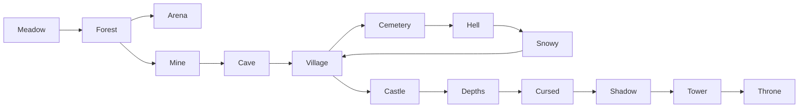

# Все зоны

#zone #index

Порядок прохождения: `Meadow → Forest → Arena → Mine → Cave → Village → Cemetery → Hell → Snowy → Castle → Depths → Cursed → Shadow → Tower → Throne`

| # | Зона | Босс | Кристаллы | Связи |
|---|------|------|-----------|-------|
| 0 | [[02-zones/Meadow\|Meadow]] | — | — | → [[02-zones/Forest\|Forest]] |
| 1 | [[02-zones/Forest\|Forest]] | [[03-bosses/Treant\|Treant]] | 4-8 | → [[02-zones/Arena\|Arena]], → [[02-zones/Mine\|Mine]] |
| 2 | [[02-zones/Arena\|Arena]] | [[03-bosses/SkeletonLord\|Skeleton Lord]] | 6-12 | ← Forest |
| 3 | [[02-zones/Mine\|Mine]] | [[03-bosses/SkeletonLord\|Skeleton Lord]] | 6-12 | → [[02-zones/Cave\|Cave]] |
| 4 | [[02-zones/Cave\|Cave]] | [[03-bosses/GiantBat\|Giant Bat]] | 10-18 | → [[02-zones/Village\|Village]] |
| 5 | [[02-zones/Village\|Village]] | [[03-bosses/PurpleDemon\|Purple Demon]] | 10-16 | → [[02-zones/Cemetery\|Cemetery]], → [[02-zones/Snowy\|Snowy]] |
| 6 | [[02-zones/Cemetery\|Cemetery]] | — | — | → [[02-zones/Hell\|Hell]] |
| 7 | [[02-zones/Hell\|Hell]] | [[03-bosses/RedDemon\|Red Demon]] | 20-35 | → [[02-zones/Snowy\|Snowy]] |
| 8 | [[02-zones/Snowy\|Snowy]] | [[03-bosses/IceSpirit\|Ice Spirit]] | 20-35 | → Village (восстановленная) |
| 9 | [[02-zones/Castle\|Castle]] | [[03-bosses/BanditLeader\|Bandit Leader]] | 25-50 | ← Village (после восстановления) |
| 10 | [[02-zones/Depths\|Depths]] | Lich King | 30-60 | → [[02-zones/Cursed\|Cursed]] |
| 11 | [[02-zones/Cursed\|Cursed]] | Ancient Evil | 40-80 | → [[02-zones/Shadow\|Shadow]] |
| 12 | [[02-zones/Shadow\|Shadow]] | Shadow King | 50-100 | → [[02-zones/Tower\|Tower]] |
| 13 | [[02-zones/Tower\|Tower]] | Fallen King | 60-120 | → [[02-zones/Throne\|Throne]] |
| 14 | [[02-zones/Throne\|Throne]] | Eternity Lord | 100-200 | Финал → Prestige |

## Связи между зонами

## Общие характеристики зон

| Параметр | Значение |
|----------|----------|
| Размер мира | 800×900 (Forest), 300×1200 (Cave), 900×2500 (Hell) |
| Мобов на зону | 8-50 |
| Сундуков | 3-10 |
| Босс | 1 (кроме Meadow, Cemetery) |
| Особые механики | Лава (Hell), traps (Cave+Forest), вагонетка (Mine) |

---

> См. также: [[03-bosses/_bosses_index|Боссы]], [[09-enemies/_enemies_index|Враги]]
