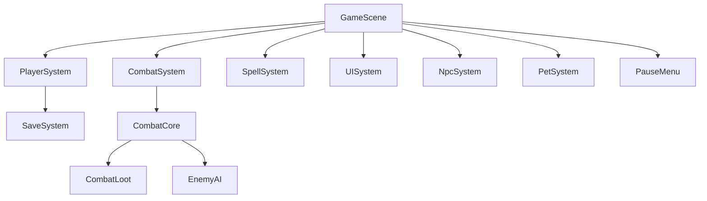

# Все системы

#system #index

| Система | Файл | Ответственность |
|---------|------|-----------------|
| [[04-systems/CombatSystem\|CombatSystem]] | `src/systems/CombatSystem.js` | Атака, урон, криты, killEnemy |
| [[04-systems/PlayerSystem\|PlayerSystem]] | `src/systems/PlayerSystem.js` | Игрок, статы, инвентарь, levelup |
| [[04-systems/SpellSystem\|SpellSystem]] | `src/systems/SpellSystem.js` | Заклинания, снаряды, щиты |
| [[04-systems/UISystem\|UISystem]] | `src/systems/UISystem.js` | HUD, инвентарь, тултипы, пауза |
| [[04-systems/NpcSystem\|NpcSystem]] | `src/systems/NpcSystem.js` | NPC, диалоги, квесты |
| [[04-systems/PetSystem\|PetSystem]] | `src/systems/PetSystem.js` | Питомцы |
| [[04-systems/SaveSystem\|SaveSystem]] | `src/save.js` | Сохранения |
| [[04-systems/HUDSystem\|HUD]] | `src/systems/HUD.js` | HUD интерфейс |
| [[04-systems/BossAI\|BossAI]] | `src/systems/BossAI.js` | Базовый AI боссов |
| [[04-systems/SpellProjectile\|SpellProjectile]] | `src/systems/SpellProjectile.js` | Снаряды с object pool |
| CombatCore | `src/systems/CombatCore.js` | Ядро боя, makeEnemy, takeDamage |
| CombatLoot | `src/systems/CombatLoot.js` | Выпадение лута, предметы |
| EnemyAI | `src/systems/EnemyAI.js` | AI врагов, патруль, атака |
| InventoryUI | `src/systems/InventoryUI.js` | UI инвентаря |
| PauseMenu | `src/systems/PauseMenu.js` | Пауза, настройки |
| QuestTracker | `src/systems/QuestTracker.js` | Отслеживание квестов |
| BaseZone | `src/systems/BaseZone.js` | Базовый класс зон |
| BaseBossAI | `src/systems/BaseBossAI.js` | Базовый AI боссов |
| ParticleSystem | `src/systems/ParticleSystem.js` | Частицы, эффекты |

## Схема взаимодействия

Все системы инициализируются в `create()` GameScene (до `_createUI`).

---

> См. также: [[07-scenes/GameScene|GameScene]], [[01-tech/ARCHITECTURE|Architecture]]
